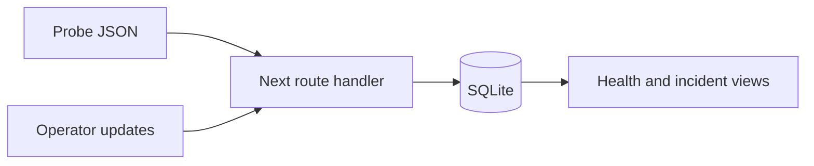

# Service Health Console

A Next.js operations workspace that turns probe samples into service-health reports and gives incidents a documented lifecycle. SQLite stores telemetry, incident versions, and update history.

## Run locally

Requires **Node.js 24+**.

```sh
npm ci
cp .env.example .env.local
npm run seed
npm run build
npm start
# http://127.0.0.1:3102
```

On Windows, copy `.env.example` to `.env.local` using your shell or file manager. The included token is only a local demo value. Enter the configured ADMIN_TOKEN in the dashboard's operator field to create or update incidents. It is held in page memory and is not written to browser storage. For development use `npm run dev`.

The seed creates **216 synthetic probes and one clearly labeled demo incident** only when there are no existing samples. It does not monitor a real company or service. The app also works with an empty database, showing no-data states instead of invented health values.

## What it demonstrates

- Reporting windows of 1, 6, 24, or 168 hours.
- Successful-probe availability, nearest-rank p95 of successful probe latencies, and sample-based error-budget usage.
- Missing and stale telemetry states; a service with no samples never appears healthy.
- Atomic batch ingestion with stable sample IDs, duplicate replay, and conflicting-ID rejection.
- Investigating → identified → monitoring → resolved incident workflow with notes and optimistic version checks.
- Bearer-token protection and same-origin checks on mutation endpoints.
- JSON service reports, a responsive dashboard, and automated checks.
- Combine service, severity, lifecycle status, and case-insensitive title filters in the incident workspace. Filters default to open incidents, show a result count, and reset in one click. They apply to the snapshot's latest 100 incidents (open first), not the entire archive. Service metrics, open-incident totals, and exported reports stay workspace-wide. A selected timeline hides when its incident no longer matches.



## Import probe samples

Generate a current **synthetic** batch, then import it while the server runs:

```sh
node scripts/make-sample.mjs > probes.local.json
npm run import -- probes.local.json
```

The JSON contract is `{"samples":[{"id":"unique-probe-id","service_id":"orders","observed_at":"ISO-8601 timestamp with timezone","success":true,"latency_ms":120}]}`. Registered service IDs are `identity`, `orders`, and `web`. Batches contain 1–500 samples, at most 256 KB. Timestamps must be within the last 30 days with at most one minute of future clock skew. Re-importing the exact same IDs/content is safe; changed content for an existing ID returns 409 and rolls back the batch.

`CONSOLE_URL` configures the importer destination; it defaults to loopback port 3102. `DB_PATH` defaults to `data/health.db`. The importer and seed script read `.env.local` if present.

## API and verification

| Endpoint | Access |
| --- | --- |
| GET /api/health | Readiness check |
| GET /api/snapshot?hours=24 | Read-only service and incident snapshot |
| GET /api/report?hours=24 | Downloadable JSON report |
| POST /api/samples | Operator token required |
| POST /api/incidents | Operator token required |
| PATCH /api/incidents/:id | Operator token + current version required |

`npm test` runs eight tests covering metric arithmetic, stale/missing data, windows, replay/rollback, validation, lifecycle conflicts, HTTP authorization, and restart persistence. After building, `npm run test:smoke` checks the running production server and importer. CI runs both suites and builds the container. Local checks cover the Node/Next runtime; Docker runtime is not claimed as locally tested.

For containers: set ADMIN_TOKEN, run `docker compose up --build`, then optionally seed with `docker compose exec console node scripts/seed.mjs`. The service runs as non-root with a persistent named volume and read-only root filesystem.

[Metric definitions and architecture](docs/architecture.md) · [Incident runbook](docs/runbook.md)

## Scope and provenance

This is a **local operations lab**, not a production monitoring platform or a vendor integration. Reads are unauthenticated; the token is a shared operator credential, not user identity or role-based access. Before sharing a deployment, add HTTPS, authenticated reads, named operator identities, per-service authorization, request limits, retention, and backups. SQLite is intentionally synchronous; incident listing is capped at 100 and probes are aggregated in process.

Probe frequency and coverage affect sample-based availability and budget calculations. They must not be presented as request-weighted SLAs or full elapsed-time uptime. Source history from the former ppn-site marketing scaffold remains in Git; the current project replaces that template with the operations console.

## Share incident filters

Copy the address bar after changing a filter. For example, `/?service=orders&severity=sev1&status=resolved&query=checkout` opens that incident view. Reload and browser Back/Forward restore the filter controls and results. Reset returns to open incidents. Reporting windows and workspace-wide metrics are unchanged.

Supported parameters are `service` (identity/orders/web), `severity` (sev1/sev2/sev3), `status` (open/investigating/identified/monitoring/resolved), and `query` (title text, up to 140 characters). Omitted parameters use defaults; `status=` explicitly includes all statuses. Invalid enum values and duplicate parameters fall back to defaults. Control characters are removed from search text. Changes create history entries, including title edits.

Only those four fields are serialized. Unknown parameters and fragments are removed on load/navigation. The operator token remains separate in page memory and is never read from or written to the URL or history state. Shared title searches are visible in browser history, so do not paste credentials into search text. Links filter the latest 100 loaded incidents, not the full archive.
